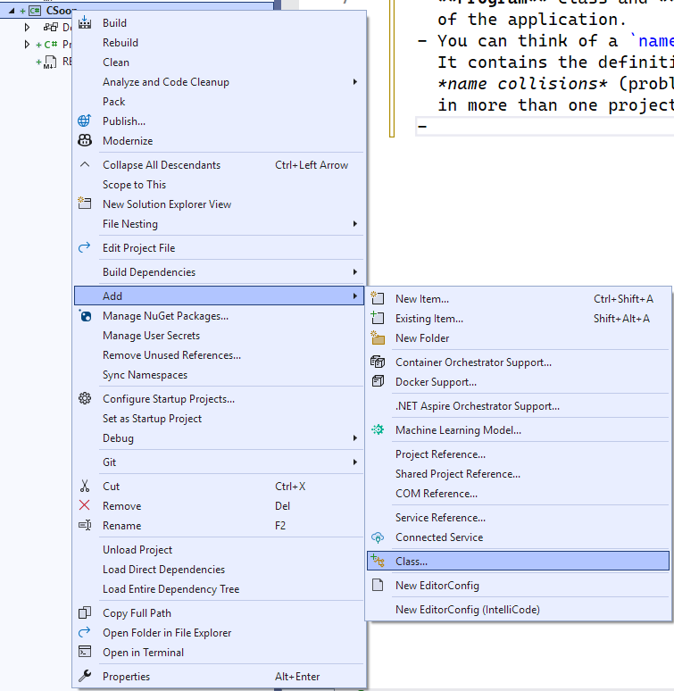
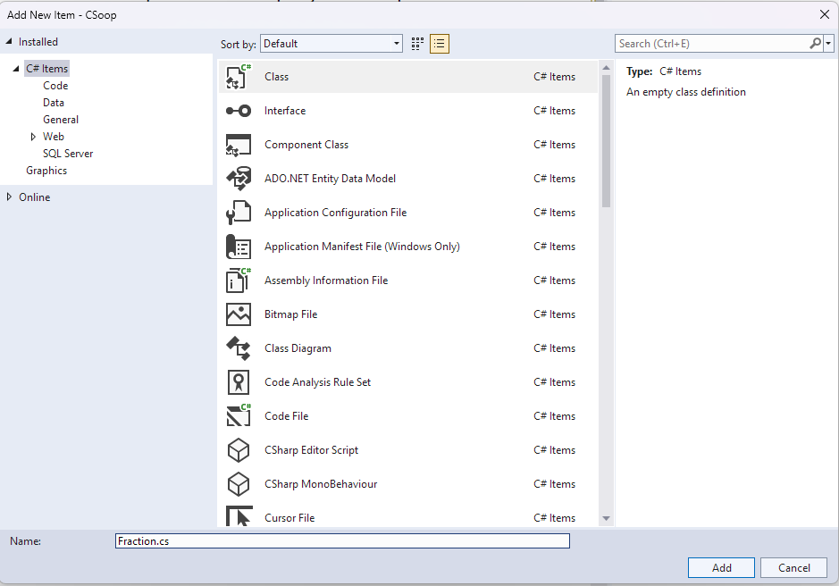

## CSoop
- This is a Console Application project which summarizes the basics
  of object-oriented programming with C# programmin language.
- In this project, I checked the option
  'Do not use top-level statements',
  so the main code file **Program.cs** displays the project namespace,
  **Program** class and **Main** function which is the entry point
  of the application.
  - You can think of a `namespace` as a library of definitions.
    It contains the definitions specific to a project and prevents
    *name collisions* (problems arising from using class or function names
    in more than one project).
- In this project, we will create our own class definitions.
  - To add a class definition, we right click on the project name
    and open the shortcut menu.
  - From the shortcut menu, we click on the **Add** command
    and choose the option **Class** from the submenu.\
    
    
    
  - On the upcoming dialog form, we name the class.
    
    

- A class is basically a code package representing a real-world object.
  With a code package like that, we enclose the attributes
  (private properties) of the object together
  and provide controlled access to them through public property definitions.
  We can also add function definitions to imitate the real-world
  behavior of the object.<br>
  >*This is the first principle of object-oriented programming;
   class definitions encapsulate the properties and behaviors of
   real-world objects.*
  - For example, our `Fraction` class represents a math fraction like 
    1/2
  - A class definition starts with a header, the term `class`
    followed by the class name:<br>
    `class Fraction`
  - That much is enough for a class header.
    The class definition consists of this header and the code block
    surrounded by curly braces **\{ \}**.
  - The class header may also contain an accessibility label.
    - The label **internal** means the class definition can only be
      used in this project.<br>
      >*If there is no label, the class definition will be internal.*
    - The label **public** is for class definitions which can be used
      from other projects.<br>
      >*Such class definitions are for class libraries shared with
       other developers. For our simple class projects, class's
       accessibility label will not matter.*
  - The name of a class can be anything which can be used for a
    variable or a function. However, it is customary to use
    the name of the real-world object represented by the class,
    like `Fraction`, `Vector`, `Employee`, etc.<br>
    >*It is also customary that the class name starts with a capital letter.*
- Following the class header, we have the class definition code block
  surrounded by curly braces **\{ \}**.
- The class definition contains definitions of fields (member variables);
  they store the values which make up the object represented
  by the class definiton.
  - For example, our `Fraction` class contains two integer fields
    which will store the values of its numerator and denominator
    (**pay** and **payda** in Turkish):
    ```
        // These two are field (member variable) definitions:
        private int _num;   // numerator (pay) value
        private int _denum; // denominator (payda) value
    ```
    >*Don't forget; in C# code, // are for inline comments.*
  - There is a custom of giving member variables names
    which start with underscore **\_** and a lowercase letter.
    This is not mandatory, but especially programmers
    working together in the same development team
    will stick to certain naming rules like that.
  - The field labels **private** means that these variables
    packaged in the class definition cannot be directly accessed
    from outside.
 
    >*If a field definition doesn't have a label, it will be assumed to be
      **private**.*
  
    >*Hiding the internal properties of the real object in **private**
      fields is known as **data hiding**. This is the second principle
      of object-oriented programming.**

- **private** fields help hide the attributes of an object,
  but we can provide controlled access to them through
  *property* definitions.
  - For example, the following property definition enables access to
    numerator value:
    ```
        public int Num
        {
            get { return _num; }
            set { _num = value; }
        }
    ```
    - The **get** block will give out the value stored in the field.
    - The **set** block will help assign a value to the field.
  - A property does not have to enable total access. For example,
    this property definition helps learn the value of denominator
    through its **get** block, but its **set** block does not assign
    the given value directly:
    ```
        public int Denum
        {
            get { return _denum; }
            set {
                if(value > 0) { _denum = value; }
                else if(value < 0)
                {
                    _num = -_num;
                    _denum = -value;
                }
                // An exception stops the program execution with an error message.
                else throw new ArgumentException("Denominator value cannot be zero!");
            }
        }
    ```
    >*Note that a property definition looks similar to a field definition,
      but it has a code block with inner get and set blocks.*
  
    >*By custom, property names start with capital letters,
      but this is not mandatory.*

- A class definition is simply a code package for a new data type;
  it is written by a *designer programmer* who knows how a code object
  representing a real-world object should behave in code.
- A *client programmer* will take a class definition from the designer programmer
  and create code objects of that type.
- The client programmer can define a variable of that class type, like:<br>
  `Fraction k1;`
- A class-type variable like the one above is a *reference variable*.
  It is basically an integer variable which can store the address of a code object.
  > *A reference variable is not an object! It merely is a name representing the object*
- The client programmer must use the new operator to create a code object of the class:<br>
  `k1 = new Fraction();`
  - The statement above will create a code object in memory containing two integer variables
    `_num` and `_denum`. The address of this memory block will be stored in the reference
    variable `k1`.
- When a class object is created with new(), the default constructor of the class is called:
  ```
        public Fraction()
        {
            Num = 0;
            Denum = 1;
        }
  ```
  - The constructor is a special function which carries the same name as the class itself.
  - The default (empty) constructor runs when no initial values are provided
    for the member variables. It assigns best default values suitable for a
    real-world object represented by the class definition.
    > *Note that our default constructor for the `Fraction` class assigns values
       to properties, not directly to member variables.
       This is the preferred way, because it ensures controlled access.*
- A client programmer may want to pass on certain initial values
  for the private fields of the new object.
  In that case, the designer programmer should create another constructor
  function which accepts the initial values as parameters:
  ```
        public Fraction(int p, int q)
        { Num = p; Denum = q; }
  ```
  >*Again, by assigning values to properties, we are reusing our codes which provide controlled access.*
  - The client programmer can use this secondary constructor like this:<br>
    `Fraction k2 = new Fraction(2,5);`
- Since a `Fraction`-type object represents a mathematical fraction in real life,
  a client programmer may want to obtain its decimal equivalent in a program.<br>
  For that, the designer programmer can put the following conversion operator
  in the class definition:
  ```
        public static explicit operator double(Fraction k)
        { return (double)k.Num / k.Denum; }
  ```
- In case a client programmer wants to have a fraction written as a string,
  like **[1/2]**, he can use the following conversion operator:
  ```
        public static explicit operator string(Fraction k)
        { return "[" + k.Num + "/" + k.Denum + "]"; }
  ```
- The following `Console.WriteLine()` statements use those operators
  to get the fraction objects written as strings and numerical values:
```
...
Console.WriteLine("{0} = {1}", (string)k1, (double)k1);
...
Console.WriteLine("{0} = {1}", (string)k2, (double)k2);
```