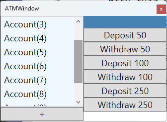
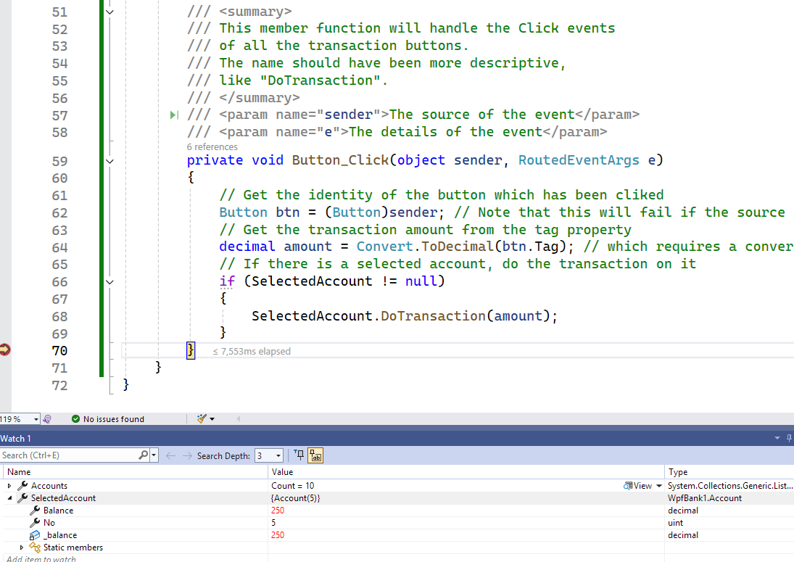

## WpfBank1

- With this project, I am showing properly binding
  WPF controls to data handled by the application.
- However, it is still a crude application,
  because
  - it uses the application window as the data source,
  - it relies on event handler functions for interactions,
  - it does not automatically reflect the changes
    in the selected object.

Let me summarize the development steps:

- I wanted to create a window with fixed dimensions,
  just like the screen of a real-world ATM machine,
  so I set the **ResizeMode** property value
  to "NoResize".
  - I also set **WindowStyle** property to "ToolWindow".
    This window style has a less prominent title bar
    with just the close button, and it does not allow
    the user to resize it.
  
    

- I divided the window grid into two columns;
  - I placed an inner grid on the left column
    which contained a `ListBox` for displaying a list of accounts
    and a button for creating new accounts.
  - I placed another inner grid on the right column
    which contained a `TextBlock` for displaying
    the balance of the account selected on the ListBox
    and buttons to perform transactions on that selected account.

- The columns of the outer grid does not have width values;
  they simply share the window width equally.
- In the right inner grid, the top row's height
  is set to "Auto"; that row will be only as high as
  the TextBlock it contains.
  - The bottom row on the right has a height "\*",
    meaning that, that row will take up the rest of the
    window height.
- You can figure out the same thing happening
  on the left inner grid, with the bottom row
  sizing itself to the + button it contains.

- In this project, I made use of data binding
  to let controls display the application data automatically.
- For example, I bound the **ItemsSource** property
  to **Accounts**, which would be a list of `Account` objects.
- I bound the **Text** content of the `TextBlock` on the right
  to **Balance** property of **SelectedAccount**.
- In WPF, **Binding**s only work with properties;
  in this project, **Accounts** and **SelectedAccount**
  are properties of the application window.
  - This is actually a drawback, because it means
    the data communications are still handled
    on the visual interface.
  - I am doing things this way for now, just as an intermediate
    step before demonstrating the proper way to make visual interface
    independent from the data-handling operations.
  - In a properly designed WPF application,
    or in any modern visual application,
    data bindings would work with a separate entity
    (usually called a ViewModel or a Visual Controller),
    or even better, with a database interface.
- With the statement in its constructor function\
  `this.DataContext = this;`\
  the window specifies itself as the source of data bindings.
  > Yes, `DataContext` means the source of data bindings.\
    *Remember it, we will use it again.*

- Notice that **SelectedItem** property of the `ListBox`
  is bound to the **SelectedAccount** property of the window,
  which represents the currently active account object
  in the **Accounts** list.
  - However, at least initially, no item may be selected
    on the `ListBox`, meaning that the active account may be none of them.
  - Since .NET now doesn't allow an object reference point to nothing,
    I had to specify this poperty as a "nullable" reference.
    > A question mark after the class type means it is a reference
      variable which may point to null (i.e. contain a zero address).
- The idea was that, the user was going to choose an account listed
  on the `ListBox` in the left column and see its balance on the 
  `TextBlock` control in the right column.
- The user could then click on transaction buttons on the right side
  and see the balance of the selected account change.
  > There are some details I left out; see the comment lines
    to figure them out.
- However, if you run the application, you will notice that
  no account balance is displayed, even after depositing and
  withdrawing any of the accounts bunch of times.
  - If you are familiar with Visual Studio development environment,
    you can set a breakpoint and debug the application
    right when a transaction button is clicked.
    
  - You will see that **SelectedAccount** indeed points to
    the account you selected on the `ListBox`
    and its balance has indeed changed.
  - The problem is that, the selected account object
    is not sending any message about the change in its balance;
    that's why we don't see the current balance
    in the `TextBlock` control.
  - Implementing the `INotifyPropertyChanged` interface
    in `Account` class would inform the data-bound
    `TextBlock` of the changes in **Balance** property.
    - Implementing that interface means changing the class
      definition header:\
      `public clas Account : INotifyPropertyChanged`
    - The above line may look like a class derivation,
      but it is actually *implementing an interface*.
      > A class implementing an interface makes a promise
        to fulfill the requirements of that interface.\
        In the case of `INotifyPropertyChanged`,
        the class definition promises that the object
        of its type will isue an event in case important
        properties (like **Balance** for `Account`) change.
    - Fullfilling that requirement in the `Account` class
      means adding this evenet definition:\
      `public event PropertyChanhedEventHandler? PropertyChanged`
    - and this oversimplified function definition
      which will issue the event message:
      ```
      protected void OnPropertyChanged(string propertyName)
      {
         if(PropertyChanged != null)
         { PropertyChanged(this, new PropertyChangedEventArgs(propertyName)); }
      }
      ```
    - Then we can add the following line to the end of
      the **set** block of the **Balance** property
      to issue the change notification for that property:\
      `OnNotifyPropertyChanged("Balance");`\
      After that, the `SelectedAccount` object will inform
      the `TextBlock` of any changes in its **Balance**.
    - However, that would not solve the problem completely,
      because we would also have to implement the same interface
      on the window itself, because the `SelectedAccount` property
      belongs to the window class.
 - A more proper solution is to package the dynamic list of
   `Accounts` and `SelectedAccount` in a separate class
   which will handle communication between data objects
   (which are `Account` objects in this application)
   and the visual controls.
   - This new class will be a **ViewModel** class,
     meanig that we are now venturing into
     Model-View-ViewModel (MVVM) architecture.
   - That viewmodel class will also have *command functions*
     which will replace the event handler functions
     for the buttons' **Click** events.
 - I will show how to do those in a second version of
   this application, but I will make use of a toolkit
   to automatically produce the repeating blocks of code.