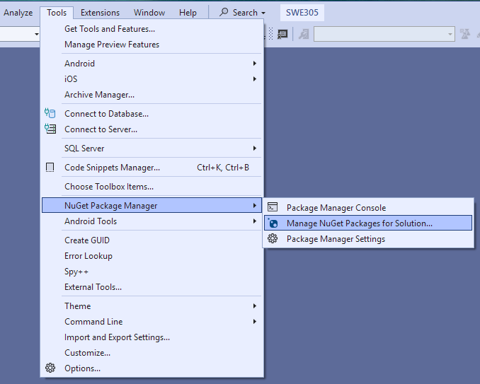
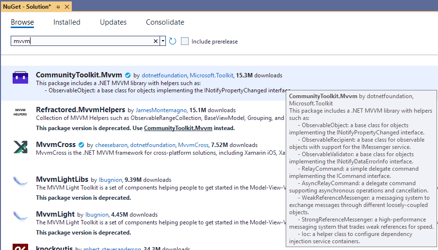
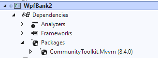
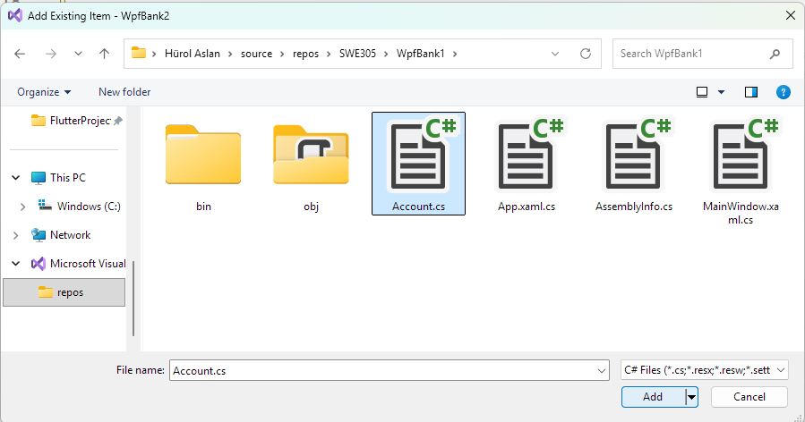

## WpfBank2
- This is the second version of the bank management
  application where I properly implement the MVVM architecture.
- I had noted I would make use of a toolkit while developing
  this version, so I first opened the ""NuGet Package Manager""
  from the menu under the header "Tools":

  
- There, I browsed to locate the **CommunityToolkit.Mvvm** package:

  
- and I installed it as part of this new project:

  

- and verified it was installed by looking into
  project references:
  
  

- I then proceeded to copying the `Account` class
  from the previous project **WpfBank1** 
  through the menu options "Add" --> "Existing Item":

  

  - I simply had to modify the **namespace** reference
    at the top of the code file with this project's name.

- In order to recreate the same visual interface,
  I copied most of the Xaml contents from the
  **MainWindow.xaml** in the older project.
  - I left out the **Click** event handlers for the buttons,
    because I was going to implement command functions
    of the viewmodel class.

- Speaking/writing of the viewmodel class,
  that's how I started it:
  ```
    public partial class BankViewModel : ObservableObject
    {
        public ObservableCollection<Account> Accounts { get; set; }

        [ObservableProperty]
        private Account? _selectedAccount;

        public BankViewModel()
        {
            Accounts = [];
            SelectedAccount = null;
        }

        [RelayCommand]
        private void CreateAccount()
        {
            Accounts.Add(new());
        }
    }
  ```
  - The class name did not have to include the words **ViewModel**;
    I added that to make it clear this class was going to work
    as my viewmodel.
  - I derived this class from `ObservableObject` class defined
    in the toolkit; that special parent class was going to make
    my work easier in implementing MVVM procedures.
  - I added the label **partial**. as required by the toolkit;
    the toolkit was going to create another part,
    a shadow copy of the class to put its automated code.
  - As you can see, this class packages the `Accounts` collection
    and the `SelectedAccount` property in its code block.
  - Another thing is that, I created this viewmodel object
    right in the **MainWindow.xaml** file, instead of defining
    it as a property of the window in the **MainWindow.xamlcs** file.
  - You can now see that the window's code file is completely
    (well, almost!) free of code. All interactions are handled
    by the viewmodel class and its shadow copy created by the toolkit.

- MVVM Toolkit requires certain procedures, too,
  but it makes MVVM implementation easier than writing code
  from scratch.
  - The first rule is that, if a property has to inform
    some controls about the changes in its value or contents,
    we do not write that property definition by ourselves.
  - Instead, we  define a private member variable
    and label that variable as an `[ObservableProperty]`.
  - The second rule is about naming that variable;
    the name should start with a lowercase letter,
  - like `selectedAccount`,
  - or with an underscore character,
    like `_selectedAccount`.
  - If we follow that second rule, the toolkit will define
    the observable property with the same name,
    but with a starting capital letter, like `SelectedAccount`.

- MVVM Toolkit also eliminates the need for event handlers.
  - Instead of event handlers, we write *command functions*,
    member functions labeled as `[RelayCommand]`.
  - We then associate control actions with commands
    and that action will excute its associated command.
  - For example, I created the command function
    **CreateAccount()** in the `BankViewModel` class
    to replace the **CreateAccount()** event handler
    of the old project's window class.
  - Then I associated that command with the + button
    on the bottom left.
  - You can run the application and see that button creating
    and adding new accounts on the listbox.
  
- Of course, `Account` class also had to be refined as an
  `ObservableObject`.
  - I left out the **Balance** property of that class
    and labeled its private member variable **_balance**
    as `[ObservableProperty]`.
  - Then I labeled the **DoTransaction()** function of that class
    as a `[RelayCommand]`. Then I associated that command
    with the transaction buttons on the right.
  - Notice that each transaction button sends the transaction amount
    as **CommandParameter**, but that parameter now requires
    converting to decimal because it is normally sent as a `string`.

- Another important change is that, the `TextBlock` at the top right
  and the transaction buttons below it would all be interacting
  with the **SelectedAccount** property of the viewmodel object.
  - I bound the `DataContext` of the right inner grid to that property
    and thus bound the controls in that grid to the same property. 