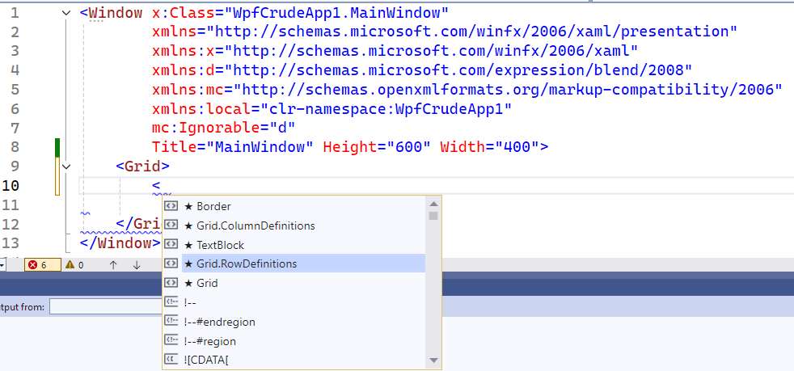
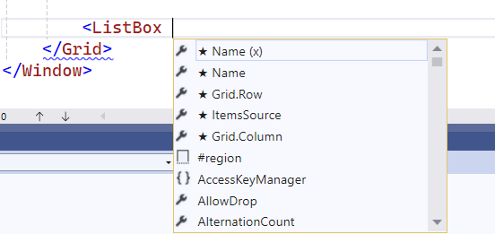
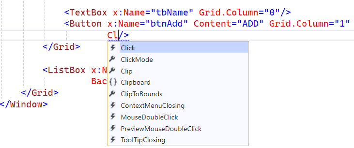
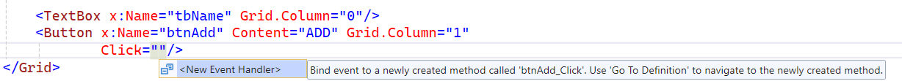

## WpfCrudeApp1

- This project demonstrates the crude way of visual programming.
- Here, I am showing writing code that will handle the events
from named controls.
- The essence of visual programming is to handle the control events
so that a user will see application doing things in response
to user's actions, such as clicking on a button or a list item.
- This time I split the aplication window's grid into rows
by adding Xaml code by hand. Here is how I started creating
the block of row definitions:

- Intellisense is a semi-smart agent which suggests element
or property names, values, etc.
I split the window grid into two rows:
  ```
    <Grid>
        <Grid.RowDefinitions>
            <RowDefinition Height="50"/>
            <RowDefinition Height="*"/>
        </Grid.RowDefinitions>

    </Grid>
  ```
- I assigned a fixed height of 50 pixels to the top row,
while I let the bottom row take the rest of the window's 
full height.
- Then I placed an inner grid into the top row
and split that grid into two columns,
while specifying a fixed width for the right column:
  ```
    <Grid>
        <Grid.RowDefinitions>
            <RowDefinition Height="50"/>
            <RowDefinition Height="*"/>
        </Grid.RowDefinitions>

        <Grid Grid.Row="0">
            <Grid.ColumnDefinitions>
                <ColumnDefinition Width="*"/>
                <ColumnDefinition Width="75"/>
            </Grid.ColumnDefinitions>
        </Grid>
    </Grid>
  ```
- The top row was going to be shared by a textbow and a button,
while the bottom row would belong to a listbox.
Here is the Xaml code for the window's main grid
after I placed the controls:
  ```
    <Grid>
        <Grid.RowDefinitions>
            <RowDefinition Height="50"/>
            <RowDefinition Height="*"/>
        </Grid.RowDefinitions>

        <Grid Grid.Row="0">
            <Grid.ColumnDefinitions>
                <ColumnDefinition Width="*"/>
                <ColumnDefinition Width="75"/>
            </Grid.ColumnDefinitions>

            <TextBox x:Name="tbName" Grid.Column="0"/>
            <Button x:Name="btnAdd" Content="ADD" Grid.Column="1"/>
        </Grid>

        <ListBox x:Name="lbNames" Grid.Row="1"
                 Background="AliceBlue"/>
    </Grid>
  ```
- Since I was going to write code to let controls interact with
each other, I had to give them names.
  > Normally, WPF does not require you name the controls
    like some other visual programming frameworks.
- Here is how Intellisense suggested the `Name` property
  when I was trying to assign a name to the listbox:
  
- The idea was that, I was going to type a name in the textbox
  and click on the button to add that name as a new item to be
  listed in the listbox.
  - To make that happen, I had to create an event handler function
    which would respond to the button's `Click` event,
    so, I picked that event name from the list of names
    suggested by Intellisense:
    
  - Then I let Visual Studio to create a new event handler function
    with an automatically-assigned name:
    

- Visual Studio added the following function to the application
  window's code file **MainWindow.xaml.cs**;
  that file was in the Visual Studio window tab underneath
  the window tab displaying the application window's 
  image and Xaml code.
  ```
        /// <summary>
        /// This function will handle the Click event from btnAdd.
        /// </summary>
        /// <param name="sender"></param>
        /// <param name="e"></param>
        private void btnAdd_Click(object sender, RoutedEventArgs e)
        {
            // Whatever was written in tbName will be added to the items listed in lbNames.
            lbNames.Items.Add(tbName.Text);
            // and the textbox tbName will be cleared.
            tbName.Clear();
        }
  ```
- I have added some extra comments to explain what is going to happen.
  You can verify those things happen by running the application.
- However, that's not the proper way to do visual programming with WPF,
  and with any other frameworks, for that matter.
  > *Writing code to directly manipulate the behavior of named controls
    will make us work hard to fix the bugs arising from changes
    in visual layouts and controls' appearances.*