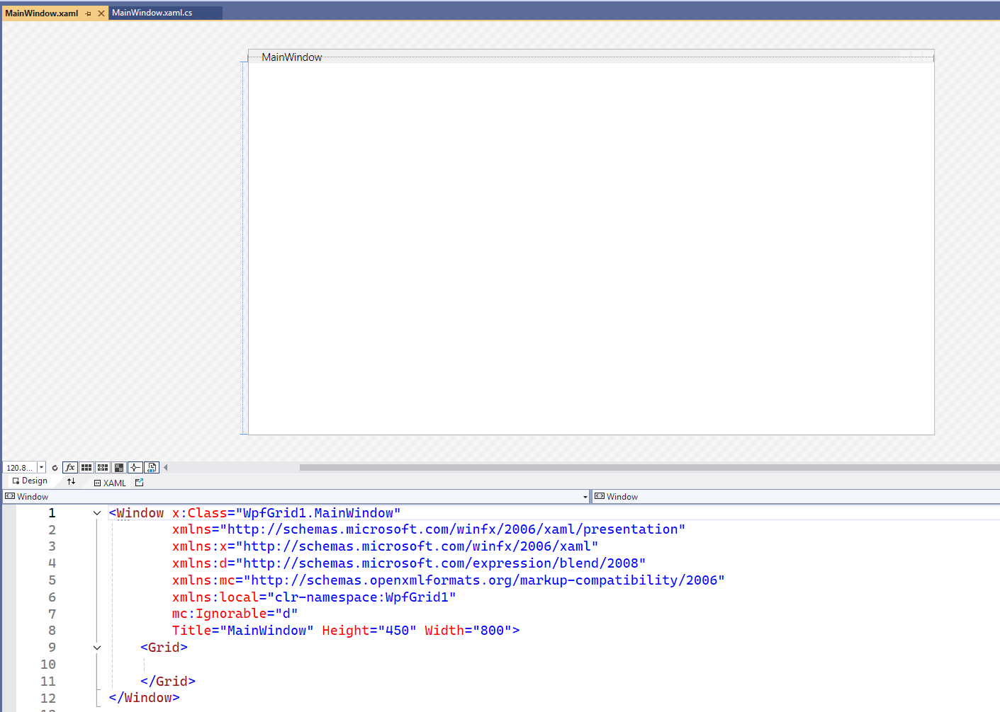
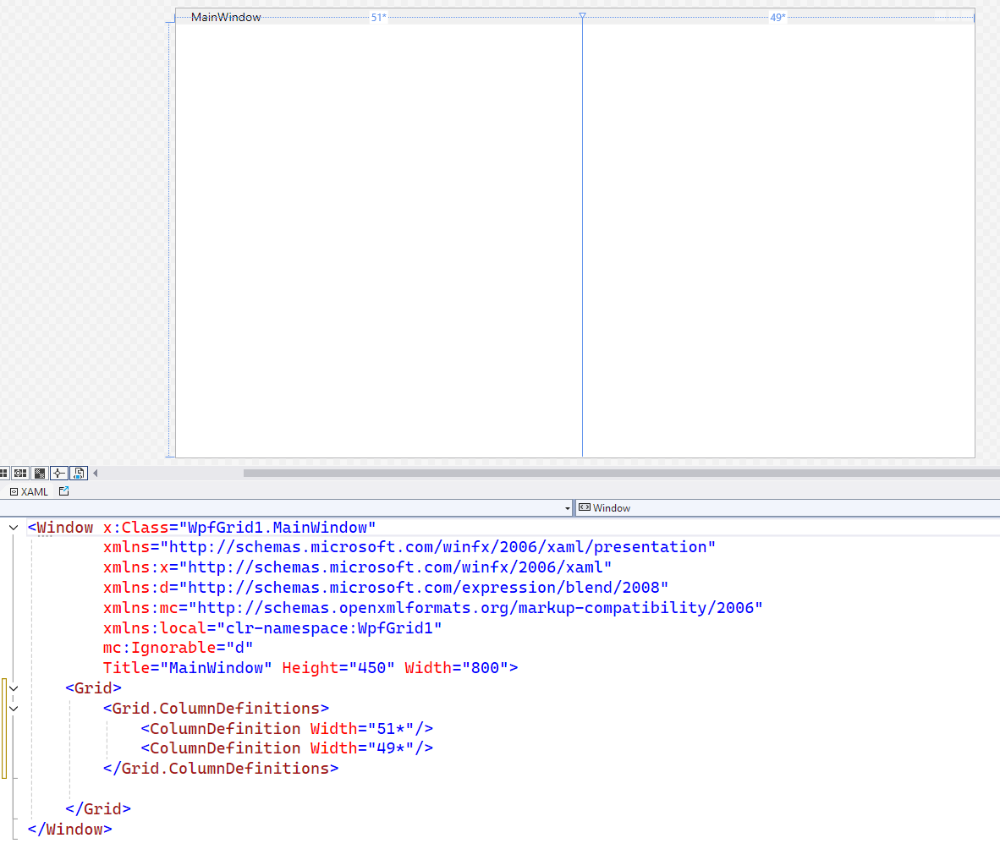
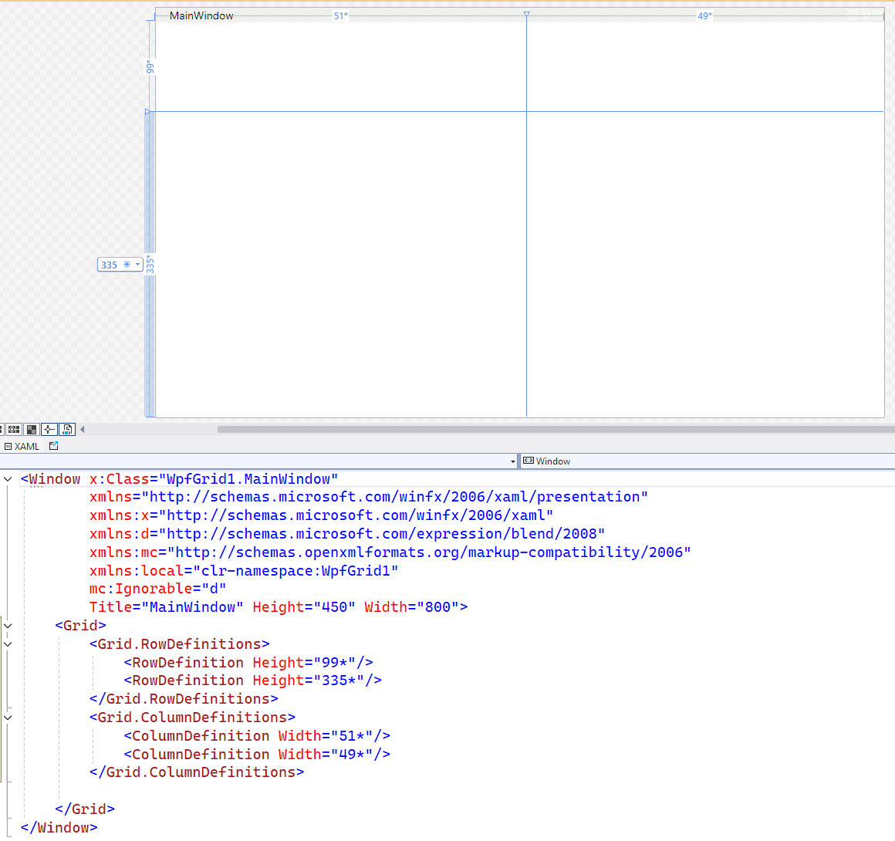

## WpfGrid1
This is our first visual programming project
based on WPF (Windows Presentation Framework).
It is for introducing the WPF container `Grid`
and show how we can use it to produce a grid-style
layout on the program window.

- I created this project with the "WPF Application"
template from the template list which appeared
when I wanted to create the new project.

- When the project was created, the main window's
visual layout was on display:

- This visual layout was initially empty,
but it was the product of the XAML code below
the window image.

  - XAML is a special language, like HTML,
    which we can use to construct a visual layout
    on our application windows.
  - Just like in HTML, it has visual elements
    with header tags like 
    `<Window>`, `<Grid>`, etc. 
    and with closing tags like 
    `<\Window>`, `<\Grid>`, etc.
  - Starting tags of visual elements may contain
    property values, such as `Title=`, `Height=`
    and `Width=` for `<Window>`.
  - We can click on the window image on top
    and place visual elements on the window
    by dragging them from the **Toolbox** tab
    on the vertical split that we see on the left.
    > *This is how a visual layout would be created
      on other graphics programming frameworks,
      like Windows Forms, but it is impractical
      with WPF. 
      We will prefer writing the elements' tags
      and property values by hand, right into
      the XAML code file.*
- In this project, I am focusing on how to create
  a grid layout with WPF container `<Grid>`.
  - I have first clicked somewhere near the middle
    on the dashed border on top of the
    window's outer box and split the window
    into two columns.
  - This is how the window image and
    the XAML file was changed:
  
  - Then I have clicked somwhere near the top
    on the dashed borderline to the left
    of the window.
    That action split the grid into two rows:
  

- If you repeat these actions yourself,
you may see different dimension values,
but they will all have asterisk **\***
after them.
  - The asterisks indicates the dimensions
  are not exact but propertional.
  - For example, 51* and 49* for the column widths
  mean that the left column will have 51 / (51+49),
  i.e. 51% of the grid's width.
- The idea is that, the visual elements -which we call
"controls"- in grid cells will have sizes
that change propertionally with the window width.
I have placed button controls in the cells
to demonstrate that.
- I placed the buttons in grid cells by specifying values
  for `Grid.Row` (0 for the top row, 1 for the bottom row)
  and for `Grid.Column` (0 for the left column, 1 for the right column).
- I have also assigned different values to font size
of the window and two of the buttons.
  - A visual control with a property unset
  by the designer will usually inherit that property
  from its container or from the window. 
  That's why **Button2** and **Button3** uses
  the window's font size, but **Button1**
  and **Button4** have their font sizes.
  - However, certain elements have specific defaults
  for certain properties. For example,
  I did not specify a background color for
  **Button3**, but it defaulted to system's control
  color instead of displaying the window's
  default white background.
- If you run the application, you will see those
four inert buttons whose sizes change proportionally
with the window size.
  - You will notice that the buttons fill up the grid cells
    they belong to, because I did not set their dimensions
    or specified any other property values which will affect
    how they are positioned.
- You can also try assigning some values to some
  different property values, like:
  - `Width`
  - `Height`
  - `HorizontalAlignment`
  - `VerticalAlignment`
  - `Margin`, etc.
You will find plenty of information on those properties,
but the best way to learn is to try them.